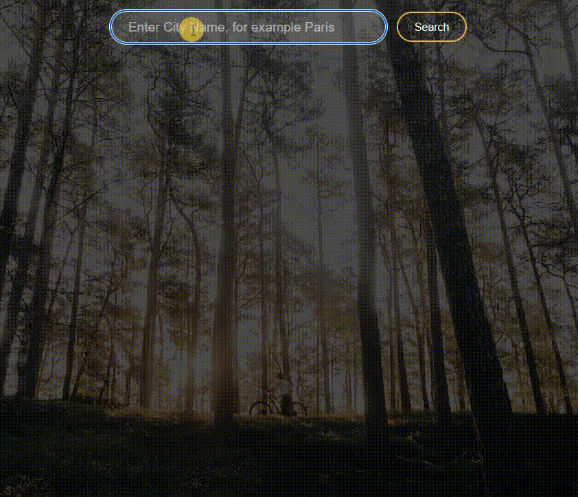

# React - weather app

# 🔗 [Live Preview](https://jazzy-sunshine-6f20d7.netlify.app)

## About this project: 

This project I practiced API calls and displaying dynamic information. I can search the name of any city and the API will fetch data about that city and display it on the screen.

---

## Features 📙

* Enter the name of any city on the planet and weather information will be displayed, such as temperature, what the temperature feels like, wind speed, and humidity

---

## Languages and features 👨‍💻 

- React: useState hook, axios, functions, if statements, 
- Sass: nesting, mixins

Thanks for checking out my projects.

<!-- learned from here 
    https://youtu.be/UjeXpct3p7M?si=ND-YS2OunqZ3tajE
 -->